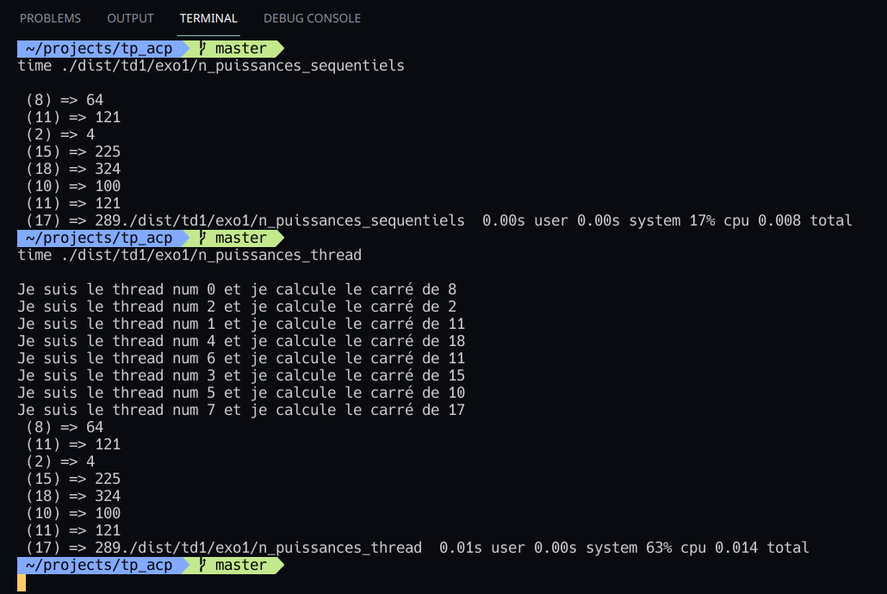
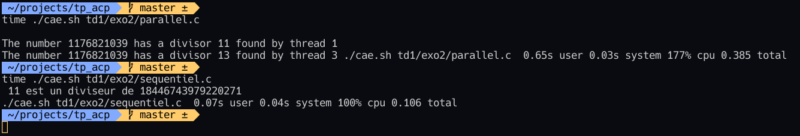

# TP Architecture et Calcul Parallèle

## Notes et remarques

### cae.sh

C'est tous simplement un script en bash très court qui sert à compiler avec *-lpthread* et éxécuter (Compile And Execute) un fichier de scripts et de générer un executable dans le dossier dist
#### utilisation
`./cae.sh [chemin du script à partir de ./scripts/]`

### omp_cae.sh
Même tâche que cae.sh sauf que ce dernier compile avec *-fopenmp* avant d'exécuter

## Exercices

### Exo1

- Les messages du thread ne s'ont pas affichés car le thread principal a terminé suffisamment rapidement avant que le thread crée puisse afficher les messages nécessaires
- Le rôle de la fonction thread_join est d'attendre la fin d'exécution du thread crée poour continuer ensuite l'execution
- replacer l'appel de la fonction pthread_exit par un simple appel d' exit() stopperait tout le programme (processus) dés que le thread crée termine, et donc avant l'affichage du dernier message du thread parent
- Le temps d'exécution du programme de calcul séquentiel est plus rapide car le coût de la création de nouveau threads dépasse l'avantage obtenu par ces derniers vu que le "job" est très simple
- 

### Exo2

- 